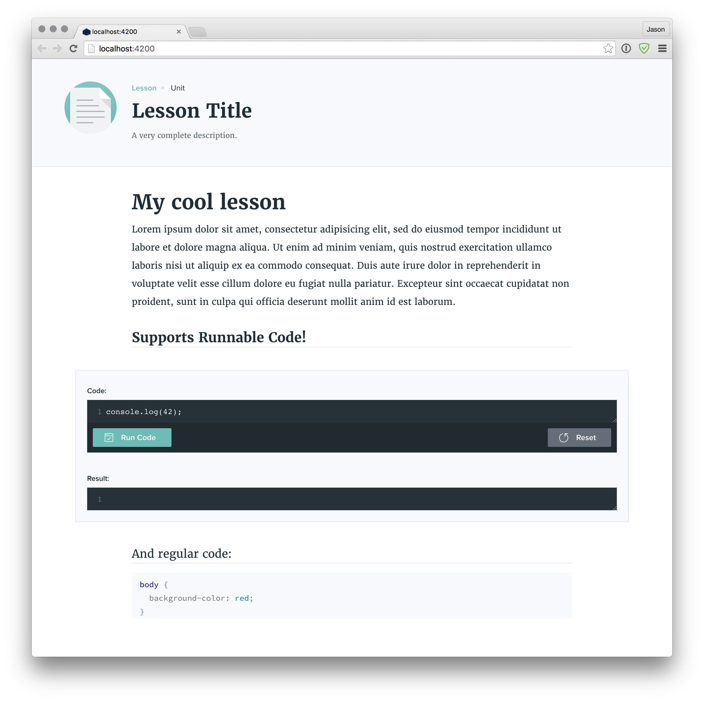

# Kudzu

Utility for previewing TIYO Lesson content while locally editing. Running it will require keychain access to Chrome (for sneaky cookie crap, you need to be signed into TIYO in Chrome). It auto loads changes and does a mediocre (read: _bad_) job of scrolling to the most recent change (or there abouts).

This is hacky and could use a lot of polish. PRs welcome.

Clone it, `cd` in, and:

    npm install
    npm start ./path/to/markdown.md

It looks like this in your browser:

